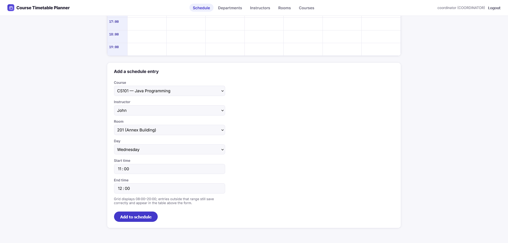
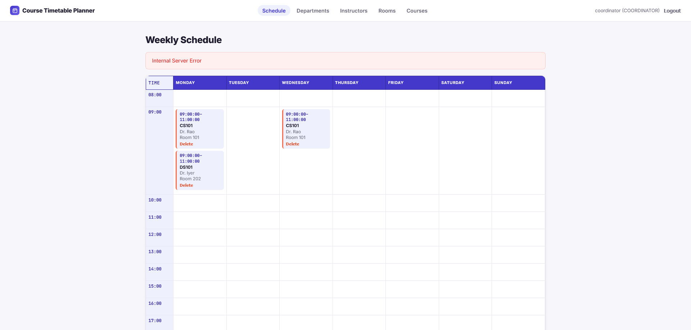
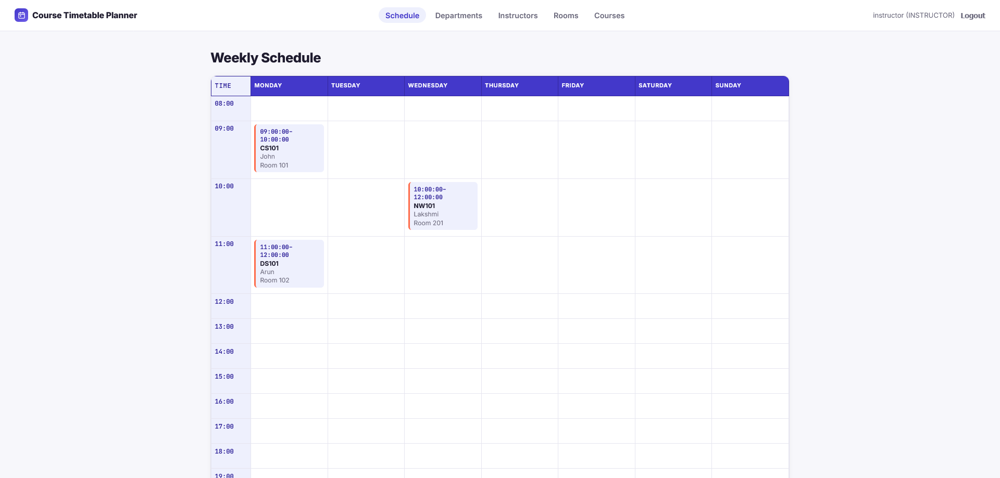

# Course Timetable Planner — React Frontend

A React + TypeScript single-page app consuming the [Course Timetable
Planner API](https://github.com/Sidharthkris/course-timetable-planner)
— the same weekly calendar grid and role-based access control as the
backend's Thymeleaf GUI, rebuilt as a proper SPA with client-side
routing, a typed API layer, and its own test suite.

This is a companion project, not a replacement: the backend's REST API
is the single source of truth, and both this SPA and the original
Thymeleaf pages can run against it simultaneously — they're just two
different clients of the same API.

## Screenshots

| Login | Weekly schedule (coordinator view) |
|---|---|
|  |  |

| Conflict detection in action | Instructor view (read-only) |
|---|---|
|  |  |

## Features

- Login screen using the backend's existing HTTP Basic auth — no
  backend auth scheme changes needed beyond one small addition (see
  below)
- Weekly calendar grid (day columns × hourly rows), ported line-for-line
  in design intent from the backend's `CalendarGridBuilder`: entries
  are anchored to their starting hour rather than visually stretched
  across rows, because two courses can legitimately run at the same
  time in different rooms and a rowspan-based layout can't represent
  that correctly
- Full CRUD pages for departments, instructors, rooms, and courses
- Role-aware UI: coordinator-only forms and delete buttons simply don't
  render for an instructor — enforced for real by the backend's
  `@PreAuthorize`, not just hidden client-side
- Structured error handling: a 409 schedule conflict renders the exact
  clashing entries, not just a generic error string
- A typed API client with one error class per HTTP status the backend
  actually returns (401 / 403 / 409 / generic 4xx)

## Tech stack

React 19 · TypeScript · Vite · React Router · Vitest · Testing Library

## Project structure

```
src/
├── main.tsx                     entry point, router setup
├── App.tsx                      route definitions
├── api/
│   ├── types.ts                 TypeScript mirrors of the backend's DTO records
│   ├── client.ts                typed fetch wrapper + error classes
│   ├── auth.ts, departments.ts, instructors.ts, rooms.ts, courses.ts, scheduleEntries.ts
├── auth/
│   ├── credentials.ts           sessionStorage-backed Basic Auth credential storage
│   └── AuthContext.tsx          React context: current user, login, logout
├── calendar/
│   ├── calendarGrid.ts          grid-layout logic (mirrors the backend's CalendarGridBuilder)
│   └── calendarGrid.test.ts     Vitest suite for the above
├── components/
│   ├── Layout.tsx, ProtectedRoute.tsx, Alert.tsx, ConfirmButton.tsx
├── pages/
│   ├── LoginPage.tsx, SchedulePage.tsx, DepartmentsPage.tsx,
│   │   InstructorsPage.tsx, RoomsPage.tsx, CoursesPage.tsx
└── styles/index.css
```

## How auth actually works here

The backend authenticates via HTTP Basic (see its `SecurityConfig`) —
there's no `/login` endpoint that returns a token. So "logging in" in
this SPA means:

1. The login form collects a username and password.
2. They're base64-encoded and stored in `sessionStorage` (not
   `localStorage` — cleared when the tab closes, deliberately not
   persisted indefinitely).
3. Every subsequent API call attaches `Authorization: Basic <encoded>`.
4. To confirm the credentials are actually valid (and find out the
   user's role), the app immediately calls `GET /api/me` — **a new,
   small endpoint added to the backend specifically to support this
   frontend** (see `backend-patch/` in this delivery, or ask me and
   I'll re-generate it). If that call succeeds, you're "logged in"; if
   it 401s, the stored credentials are cleared and an error shows.

This is a reasonable match for the backend's existing auth model
without requiring a bigger backend change (JWT, sessions, etc.) — but
it is a simplification worth naming: a production deployment would
likely move the backend to token-based auth, at which point only
`src/auth/` and `src/api/client.ts` in this project would need to
change, not the pages or the calendar logic.

## Running it

### 1. Add the backend endpoint this frontend needs

See `backend-patch/INSTRUCTIONS.md` (delivered alongside this project) —
one new controller file, no changes to existing backend files.

### 2. Start the backend

In the backend project:
```bash
mvn spring-boot:run -Dspring-boot.run.profiles=dev
```

### 3. Install and run the frontend

```bash
npm install
npm run dev
```

Open **http://localhost:5173**. The Vite dev server proxies `/api/*`
requests to `http://localhost:8080` (configured in `vite.config.ts`),
so the browser sees everything as same-origin — no CORS setup needed
for local development.

Log in with the same demo accounts as the Thymeleaf GUI:
- `coordinator` / `coordinator123` — full access
- `instructor` / `instructor123` — view only

### 4. Run the tests

```bash
npm test
```

### 5. Type-check and build for production

```bash
npx tsc -b --noEmit
npm run build
```

The build output in `dist/` is static — it can be served by any static
host, or copied into the backend's `src/main/resources/static` folder
if you'd rather have Spring Boot serve both the API and the frontend
from one origin (avoids CORS entirely, but would need one additional
`permitAll()` rule in `SecurityConfig` for the static asset paths so
the login page's own JS bundle can load before authentication — ask if
you want this wired up).

## The calendar grid, and why it's built this way

Same rationale as the backend's version, because it's solving the same
problem: two courses can legitimately run at the same time in
different rooms (the conflict detector only forbids the same
instructor or room double-booking, not the calendar slot itself). Each
grid cell holds a *list* of entries rather than at most one, and no
entry visually spans multiple rows — a rowspan-equivalent layout can't
cleanly represent two different-duration entries overlapping in the
same day/time column. Entries outside the displayed 08:00–20:00 window
aren't dropped; they render in a fallback table below the grid.

`calendarGrid.ts` has zero dependency on React, routing, or the API
client — it's pure data transformation, which is why it's the one part
of this app with full unit test coverage.

## Possible extensions

- Move authentication to JWT once/if the backend adds it — isolated to
  `src/auth/` and `src/api/client.ts`
- React Query or SWR for caching/revalidation instead of manual
  `useEffect` + `useState` data fetching
- Component tests for the pages (Testing Library is already installed;
  only the pure grid logic has tests so far)
- Drag-to-reschedule on the calendar grid, calling
  `PUT /api/schedule-entries/{id}` on drop

## License

MIT
